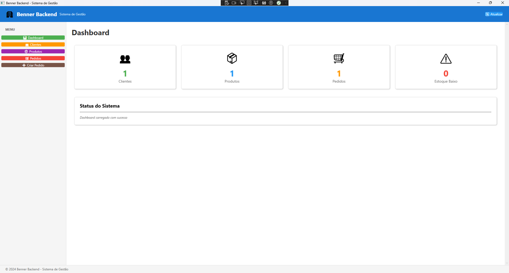
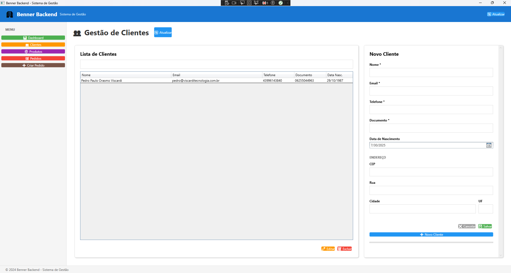
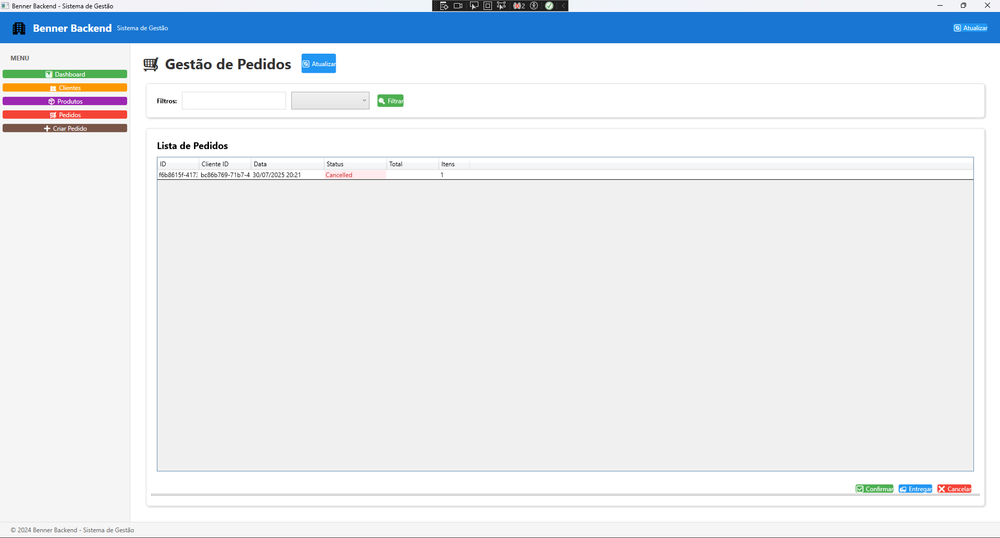
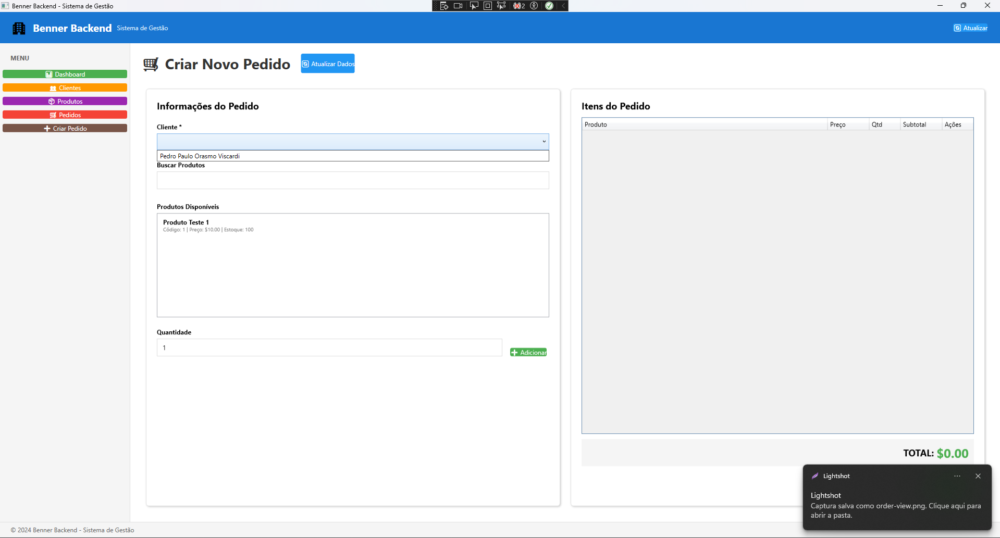

# 🏢 Benner Backend - Sistema de Gestão WPF

<div align="center">
  
  
  
  
  
</div>

---

## 📖 Sobre o Projeto

Sistema completo de gestão empresarial desenvolvido em **WPF** com **.NET Framework 4.6.2**, implementando **Clean Architecture**, **CQRS** e princípios **SOLID** conforme especificações do teste técnico.

### 🎯 Funcionalidades Implementadas
- 👥 **Gestão de Clientes** - CRUD completo com validações
- 📦 **Controle de Produtos** - Estoque, categorias e alertas
- 🛒 **Gerenciamento de Pedidos** - Criação, itens e controle de status
- 📊 **Dashboard** - Métricas em tempo real e visão analítica

---

## 🚀 Tecnologias Utilizadas

- **C# 7.3** - Linguagem principal
- **.NET Framework 4.6.2** - Framework base
- **.NET Standard 2.0** - Bibliotecas compartilhadas
- **WPF (Windows Presentation Foundation)** - Interface gráfica
- **XAML** - Markup para UI
- **Microsoft.Extensions.DependencyInjection** - Injeção de dependência

---

## 🏗️ Arquitetura

### Clean Architecture + CQRS
```
🖥️ Presentation Layer (WPF)
    ↓
📋 Application Layer (Use Cases)
    ↓
🏛️ Domain Layer (Business Logic)
    ↓
🗄️ Infrastructure Layer (Data Access)
```


### Padrões Implementados
- **CQRS** - Separação de Commands e Queries
- **Repository Pattern** - Abstração de acesso a dados
- **Command Pattern** - Encapsulamento de operações
- **Factory Pattern** - Criação de ViewModels
- **Service Locator** - Resolução de dependências
- **MVVM** - Separação de responsabilidades na UI

---

## 💡 Princípios SOLID

- **S** - Single Responsibility: Cada handler tem uma única responsabilidade
- **O** - Open/Closed: Entidades abertas para extensão, fechadas para modificação
- **L** - Liskov Substitution: Interfaces implementáveis de forma intercambiável
- **I** - Interface Segregation: Interfaces específicas por contexto
- **D** - Dependency Inversion: Dependência de abstrações, não implementações

---

## 📱 Interface do Sistema

### 🎛️ Dashboard Principal

*Visão geral com métricas de clientes, produtos, pedidos e alertas de estoque*

### 👥 Gestão de Clientes

*CRUD completo de clientes com validações e controle de status*

### 📦 Controle de Produtos

*Gestão de produtos com controle de estoque e alertas automáticos*

### 🛒 Gerenciamento de Pedidos

*Listagem e controle completo do ciclo de vida dos pedidos*

### ➕ Criação de Pedidos

*Interface intuitiva para criação de pedidos com seleção de clientes e produtos*

---

## 🗂️ Estrutura do Projeto

```
📁 Benner.Backend.WPF/
├── 🎯 Benner.Backend.Domain/
│   ├── Entities/ (Customer, Product, Order, OrderItem)
│   ├── ValueObjects/ (Address)
│   ├── Enumerators/ (CustomerStatus, ProductStatus, OrderStatus)
│   └── Repositories/ (Interfaces)
│
├── 📋 Benner.Backend.Application/
│   ├── UseCases/ (Commands & Queries organizados por entidade)
│   ├── Handlers/ (Command & Query Handlers)
│   └── Common/ (CommandBus, QueryBus)
│
├── 🗄️ Benner.Backend.Infrastructure/
│   ├── Repositories/ (Implementações concretas)
│   └── DependencyInjection/ (Registro de serviços)
│
├── 🔗 Benner.Backend.Shared/
│   ├── Commands/ (Interfaces base)
│   ├── Queries/ (Interfaces base)
│   └── Common/ (Result<T>, interfaces compartilhadas)
│
└── 🖥️ Benner.Backend.WPF.App/
    ├── Views/ (Interfaces XAML)
    ├── ViewModels/ (Lógica de apresentação)
    ├── Services/ (Factory, ServiceLocator)
    ├── Commands/ (RelayCommand, AsyncRelayCommand)
    └── Converters/ (Conversores para data binding)
```


---

## ⚙️ Como Executar

### Pré-requisitos
- **Visual Studio 2019+** ou **JetBrains Rider**
- **.NET Framework 4.6.2** SDK
- **Windows 10/11**

### Passos
1. Clone o repositório
```shell script
git clone https://github.com/pedroviscardi/benner-test.git
cd benner-test
```

2. Abra a solução `Benner.Backend.WPF.sln`
3. Restaure os pacotes NuGet
4. Compile e execute o projeto `Benner.Backend.WPF.App`

---

## 🧪 Funcionalidades Detalhadas

### 👥 Gestão de Clientes
- ✅ **Cadastro** com validações completas
- ✅ **Listagem** com pesquisa e filtros
- ✅ **Edição** de dados existentes
- ✅ **Exclusão** com confirmações
- ✅ **Status** ativo/inativo
- ✅ **Endereço** como value object

### 📦 Controle de Produtos
- ✅ **Cadastro** com categorização
- ✅ **Controle de estoque** em tempo real
- ✅ **Alertas** de estoque baixo no dashboard
- ✅ **Gestão de preços** e margens
- ✅ **Status** disponível/indisponível
- ✅ **Atualização** de quantidades

### 🛒 Gerenciamento de Pedidos
- ✅ **Criação** com seleção de cliente
- ✅ **Adição/remoção** de produtos
- ✅ **Cálculo automático** de totais e subtotais
- ✅ **Controle de status** (Pendente → Confirmado → Entregue → Cancelado)
- ✅ **Aplicação de descontos**
- ✅ **Validações** de negócio

### 📊 Dashboard Analítico
- ✅ **Contadores** em tempo real
- ✅ **Métricas** de clientes, produtos e pedidos
- ✅ **Alertas** de produtos com estoque baixo
- ✅ **Status** do sistema com loading
- ✅ **Navegação** rápida entre módulos

---

## 🔧 Implementação CQRS

### Commands (Operações de Escrita)
```csharp
// Exemplo de Command
public class CreateOrderCommand : ICommand<Result<Order>>
{
    public Guid CustomerId { get; }
    
    public CreateOrderCommand(Guid customerId)
    {
        CustomerId = customerId;
    }
}

// Handler correspondente
public class CreateOrderHandler : ICommandHandler<CreateOrderCommand, Result<Order>>
{
    private readonly IOrderRepository _repository;
    
    public async Task<Result<Order>> HandleAsync(CreateOrderCommand command)
    {
        // Implementação da lógica de negócio
    }
}
```


### Queries (Operações de Leitura)
```csharp
// Exemplo de Query
public class GetAllCustomersQuery : IQuery<Result<IEnumerable<Customer>>>
{
}

// Handler correspondente  
public class GetAllCustomersHandler : IQueryHandler<GetAllCustomersQuery, Result<IEnumerable<Customer>>>
{
    private readonly ICustomerRepository _repository;
    
    public async Task<Result<IEnumerable<Customer>>> HandleAsync(GetAllCustomersQuery query)
    {
        // Implementação da consulta
    }
}
```


---

## 🎨 Padrões de Interface

### MVVM Pattern
- **Views** (XAML) - Definição visual da interface
- **ViewModels** - Lógica de apresentação e binding
- **Models** - Entidades de domínio

### Data Binding e Commands
- **RelayCommand** - Comandos síncronos
- **AsyncRelayCommand** - Comandos assíncronos
- **Converters** - Transformação de dados para exibição
- **ObservableCollection** - Coleções reativas

---

## 🧩 Injeção de Dependência

```csharp
// Configuração no App.xaml.cs
services.AddApplication();
services.AddInfrastructure();

// ServiceLocator para resolução
public static T GetService<T>()
{
    return _serviceProvider.GetService<T>();
}

// ViewModelFactory
public static CustomerViewModel CreateCustomerViewModel()
{
    return new CustomerViewModel(
        ServiceLocator.GetService<IQueryHandler<GetAllCustomersQuery, Result<IEnumerable<Customer>>>>()
    );
}
```


---

## 📊 Métricas e Validações

### Validações Implementadas
- **Clientes**: Nome obrigatório, email válido, telefone formatado
- **Produtos**: Nome único, preço positivo, estoque não negativo
- **Pedidos**: Cliente selecionado, pelo menos um item, quantidades válidas

### Tratamento de Erros
- **Result Pattern** para operações que podem falhar
- **Try-Catch** com mensagens amigáveis
- **Loading states** durante operações assíncronas
- **Feedback visual** para o usuário

---

## 🤝 Contribuição

### Como Contribuir
1. **Fork** o projeto
2. **Clone** o repositório
```shell script
git clone https://github.com/pedroviscardi/benner-test.git
```

### Padrões de Código
- Seguir princípios **SOLID**
- Documentar APIs públicas
- Usar **conventional commits**